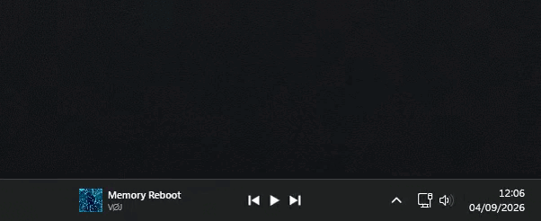

# 🎵 Taskbar Music Widget (Windows 11 / 10)


Un widget nativo, ligero y elegante para la barra de tareas de Windows que proporciona controles multimedia integrados en tiempo real con una interfaz flotante (*Flyout*) inspirada en el diseño Fluent y Spotify.

<p align="center">
  
</p>

---

## ✨ Características Principales

- **Integración Fluida con la Barra de Tareas:** Se acopla de manera limpia al espacio de la bandeja del sistema sin marcos molestos ni fondos desentonados.
- **Detección Universal de Medios (GSMTC):** Compatible automáticamente con Spotify, YouTube, Twitch, Netflix, Soundcloud, VLC, Chrome, Opera, Edge, Brave y cualquier reproductor compatible con Windows Media.
- **Tarjeta Flotante Expandible (*Flyout*):** Al pasar el ratón sobre el widget, se despliega una tarjeta flotante interactiva con carátula en alta resolución, título, artista, barra de progreso con desplazamiento manual (*scrubbing*) y controles completos.
- **Animación Cinemática de Texto (*Marquee con KeyFrames*):**
  - Implementado tanto en el widget de la barra como en la tarjeta flotante (*Flyout*).
  - Medición tipográfica exacta subpíxel mediante `FormattedText` para evitar cualquier recorte accidental.
  - Pausas estratégicas de 2 segundos al inicio y al final de cada ciclo, permitiendo leer títulos y nombres de artistas largos con total comodidad y sin prisas.
- **Soporte Multilingüe de la Interfaz (Español / English):** Detecta automáticamente el idioma de visualización de Windows (`CultureInfo.CurrentUICulture`), adaptando al instante los textos de la interfaz (como *"Sin música"* / *"No music playing"*), controles del flyout, notificaciones HUD de volumen y menús contextuales, preservando siempre intactos y fidedignos los títulos originales de las canciones y vídeos.
- **Aleatorio Inteligente (*Smart Shuffle*) de Spotify:** Integración bidireccional con Spotify mediante **Windows UI Automation** que detecta y conmuta entre *Desactivado*, *Aleatorio normal* y *Smart Shuffle* con su destello característico (`✦`).
- **Control de Volumen con Rueda del Ratón:** Ajuste directo del volumen maestro del sistema en saltos exactos del **5%** mediante interfaces COM de bajo nivel (**CoreAudio IAudioEndpointVolume**).
- **Enfoque Inteligente y Conmutación de Pestañas:**
  - Al hacer clic en la carátula o título, activa la aplicación correspondiente **sin alterar su tamaño ni desmaximizarla** (incluso en segundas pantallas).
  - En navegadores (Opera, Chrome, Edge), localiza la pestaña exacta que está reproduciendo contenido (por ejemplo, YouTube) y cambia a ella automáticamente mediante UI Automation.
- **Ocultación Automática en Pantalla Completa:** Monitoreo reactivo para ocultarse instantáneamente al jugar a pantalla completa, ver vídeos sin bordes o cuando la barra de tareas de Windows se auto-oculta.
- **Optimización Extrema de Recursos:** Consumo prácticamente nulo de CPU (< 0.1%) y uso reducido de memoria RAM (~30 MB).

---

## 🛠️ Stack Tecnológico y Arquitectura

- **Framework:** .NET 8 (C#) con Windows Presentation Foundation (WPF).
- **Windows Runtime (WinRT):** `Windows.Media.Control.GlobalSystemMediaTransportControlsSessionManager` para escucha de eventos multimedia en tiempo real.
- **Win32 P/Invoke:** Manipulación avanzada de ventanas (`user32.dll`, `dwmapi.dll`), gestión de Z-order (`WS_EX_TOOLWINDOW`, `WS_EX_NOACTIVATE`) y cálculo de monitores (`MonitorFromWindow`).
- **UI Automation:** `System.Windows.Automation` para inspección de árboles de accesibilidad de Chromium y control de botones nativos entre procesos.
- **COM Interop:** Implementación de `IMMDeviceEnumerator` y `IAudioEndpointVolume` para control directo del hardware de sonido de Windows.

---

## 🚀 Instalación y Compilación

### Requisitos
- Windows 10 (versión 19041+) o Windows 11.
- .NET 8 SDK.

### Compilar desde la terminal
```bash
# Clonar el repositorio
git clone https://github.com/KillianTR/TaskbarMusicWidget.git
cd TaskbarMusicWidget

# Compilar proyecto
dotnet build -c Release

# Publicar ejecutable optimizado autoportante
dotnet publish -c Release -r win-x64 --self-contained false -p:PublishSingleFile=true
```

El ejecutable listo para usar se generará en:
`bin/Release/net8.0-windows10.0.19041.0/win-x64/publish/TaskbarMusicWidget.exe`

---

## 📌 Historial de Versiones (Changelog)

### v0.8.2
- **Ajuste de Proporción en Barra (Hotfix):** Reducción de la anchura total a 230px, eliminando el espacio excesivo entre el texto y los botones para un diseño compacto y armonioso.
- **Activación Óptima del Marquee:** Con el contenedor ajustado a ~110px, cualquier título de longitud estándar o media activa de forma natural el desplazamiento cinemático sin generar huecos en títulos cortos.

### v0.8.1
- **Internacionalización Dinámica (i18n):** Detección automática del idioma del sistema operativo (Español / Inglés).
- **Traducción de Interfaz y Estados:** Adaptación en tiempo real de los textos del HUD (ej. *"Sin música"* / *"No music playing"*), tooltips descriptivos, notificaciones de volumen y menús contextuales. Los títulos y nombres originales de canciones y vídeos se preservan intactos sin alteraciones.
- **Integración de Demo Visual:** Incorporación de `demo.gif` con reproducción automática continua en el README principal.

### v0.8.0
- **Marquee Cinemático con KeyFrames:** Reemplazo de la animación básica por `DoubleAnimationUsingKeyFrames` con pausas de 2 segundos en ambos extremos para lectura completa de títulos largos.
- **Soporte de Marquee en Flyout:** La tarjeta flotante ahora también incluye scroll dinámico para títulos y artistas que sobrepasen el ancho de la tarjeta.
- **Medición Tipográfica Exacta:** Uso de `FormattedText` y DPI del sistema para calcular el ancho real de fuentes en lugar de depender de pases de layout diferidos.
- **Ampliación de Contenedores:** Aumento de anchura a 280px en el widget de la barra y a 340px en la tarjeta flotante para mayor visibilidad a simple vista.
- **Sincronización Bidireccional de Smart Shuffle:** Soporte completo para el ciclo de 3 estados de Spotify con icono de destello (`✦`).
- **Preservación de Ventanas Maximizadas:** Eliminación de llamadas DWM disruptivas al enfocar reproductores en monitores secundarios.

---

## 📄 Licencia

Este proyecto está bajo la Licencia MIT. Siéntete libre de utilizarlo, modificarlo y distribuirlo.
